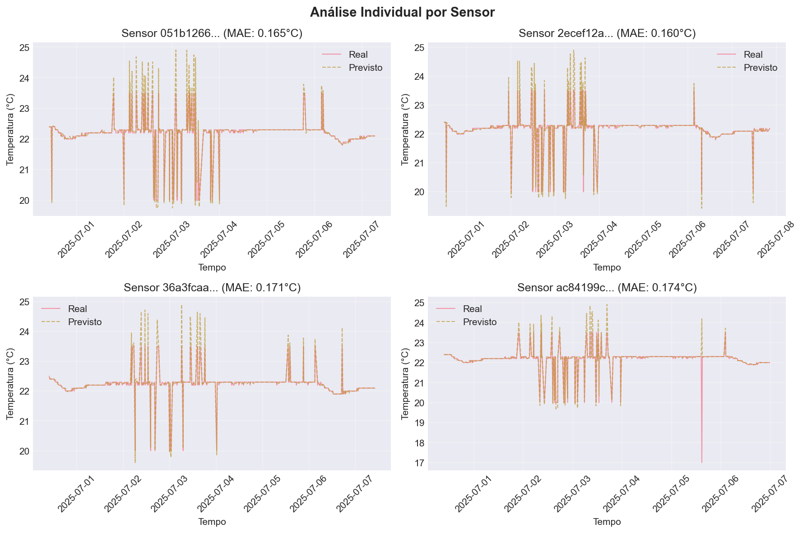
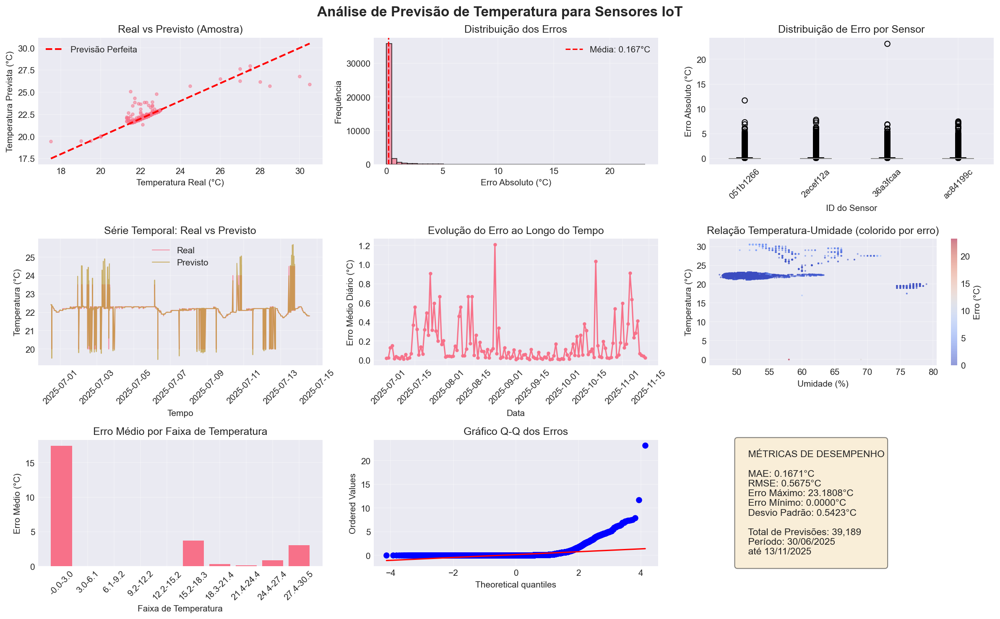

# FIAP - Faculdade de Informática e Administração Paulista 

<p align="center">
<a href= "https://www.fiap.com.br/"></a>
</p>

<br>

## Integrantes

- Lucas Medeiros Leite - rm564892
- Douglas de Souza Felipe - rm561335
- Richard Seberino Marques - rm563313
- Évelyn Zenira Rodrigues de Araujo - rm562451
- Luis Fernando dos Santos Costa - rm565285

## 👩‍🏫 Professores:
### Tutor(a) 
- <a href="https://github.com/leoruiz197">Leo Ruiz</a>
### Coordenador(a)
- <a href="https://www.linkedin.com/in/andregodoichiovato/">Andre Godoi</a>

## 🚀 Configuração do Projeto

### Pré-requisitos
- Python 3.x instalado na máquina

### Configuração do Ambiente Virtual

#### macOS / Linux

```bash
# Criar o ambiente virtual
python3 -m venv .venv

# Ativar o ambiente virtual
source .venv/bin/activate

# Instalar as dependências
pip install -r requirements.txt
```

#### Windows

```bash
# Criar o ambiente virtual
python -m venv .venv

# Ativar o ambiente virtual
.venv\Scripts\activate

# Instalar as dependências
pip install -r requirements.txt
```

### Desativando o Ambiente Virtual

Para desativar o ambiente virtual em qualquer sistema operacional:

```bash
deactivate
```

### Verificando a Instalação

Para verificar se as dependências foram instaladas corretamente:

```bash
pip list
```

## 📁 Estrutura do Projeto

### Diretório `model`

O diretório `src/model/` contém os componentes principais do modelo de Machine Learning para previsão de temperatura:

- **`predictive_model.py`**: Implementação do modelo Random Forest para prever temperaturas de sensores IoT
  - Classe `FeatureEngineer`: Engenharia de features temporais e históricas
  - Classe `TemperaturePredictor`: Modelo principal de previsão
  - Processamento de dados de sensores com features como:
    - Features temporais (hora, dia da semana, mês, trimestre)
    - Features cíclicas (seno/cosseno para capturar padrões circulares)
    - Lags e médias móveis para capturar tendências históricas
  - Métricas de avaliação: MAE, RMSE, R² Score

- **`visualize_predictions.py`**: Módulo de visualização dos resultados
  - Classe `PredictionVisualizer`: Gera gráficos e análises visuais
  - Visualizações incluem:
    - Comparação entre valores reais vs previstos
    - Análise de resíduos e distribuição de erros
    - Gráficos temporais de desempenho
    - Heatmaps de correlação

### Diretório `analysis`

O diretório `src/analysis/` fornece ferramentas interativas para análise do modelo:

- **`model_info.py`**: Sistema interativo de análise do modelo
  - Interface de linha de comando interativa
  - Menu com opções para:
    1. Visualizar métricas de desempenho (MAE, RMSE, R²)
    2. Entender como o modelo funciona
    3. Analisar desempenho por sensor individual
    4. Estatísticas dos dados de temperatura e umidade
    5. Features mais importantes do modelo
    6. Interpretação e aplicações práticas
    7. Análise detalhada de erros
    8. Relatório executivo completo
    9. Visualização de dashboards

- **`predictions_results.csv`**: Arquivo com resultados das previsões
  - Contém valores reais vs previstos
  - Timestamps e identificadores de sensores
  - Base para análises e visualizações

### Como Executar

#### Treinar o Modelo
```bash
cd src/model
python predictive_model.py
```

#### Visualizar Resultados
```bash
cd src/model
python visualize_predictions.py
```

#### Sistema Interativo de Análise
```bash
cd src/analysis
python model_info.py
```

## 🗄️ Banco de Dados

### Modelo de Dados

O projeto utiliza um modelo relacional otimizado para armazenamento e análise de dados de sensores IoT. O diagrama ERD completo está disponível em `document/erd.md`.

### Descrição das Entidades

#### 📊 **SENSOR**
Armazena informações sobre cada dispositivo sensor físico instalado no ambiente.

| Campo | Tipo | Descrição | Motivo da Inclusão |
|-------|------|-----------|-------------------|
| `id` | BIGINT | Chave primária auto-incremento | Identificação única interna |
| `sensor_uuid` | UUID | Identificador único do sensor | Correspondência com dados do CSV e identificação global |
| `sensor_name` | VARCHAR | Nome descritivo do sensor | Facilitar identificação humana |
| `latitude` | DECIMAL | Coordenada de latitude | Geolocalização para análise espacial |
| `longitude` | DECIMAL | Coordenada de longitude | Geolocalização para análise espacial |
| `created_at` | DATETIME | Data de registro | Rastreabilidade e auditoria |
| `is_active` | BOOLEAN | Status operacional | Controle de sensores ativos/inativos |

#### 📈 **MEASUREMENT**
Registra todas as leituras coletadas pelos sensores.

| Campo | Tipo | Descrição | Motivo da Inclusão |
|-------|------|-----------|-------------------|
| `id` | BIGINT | Chave primária | Identificação única da medição |
| `sensor_id` | BIGINT | FK para SENSOR | Relacionamento com sensor origem |
| `humidity` | DECIMAL | Umidade relativa (%) | Dado principal coletado |
| `temperature` | DECIMAL | Temperatura (°C) | Dado principal coletado |
| `timestamp` | DATETIME | Momento da medição | Análise temporal e séries temporais |
| `created_at` | DATETIME | Data de inserção | Controle de ingestão de dados |

#### 🔧 **SENSOR_TYPE**
Define especificações técnicas dos diferentes modelos de sensores.

| Campo | Tipo | Descrição | Motivo da Inclusão |
|-------|------|-----------|-------------------|
| `type_name` | VARCHAR | Nome do tipo (DHT22, BME280) | Categorização de sensores |
| `manufacturer` | VARCHAR | Fabricante | Rastreabilidade de fornecedor |
| `humidity_min/max_range` | DECIMAL | Faixa operacional de umidade | Validação de dados |
| `temp_min/max_range` | DECIMAL | Faixa operacional de temperatura | Validação de dados |
| `accuracy` | DECIMAL | Precisão da medição | Análise de confiabilidade |

#### 🚨 **ALERT_RULE**
Configurações de regras para monitoramento automático.

| Campo | Tipo | Descrição | Motivo da Inclusão |
|-------|------|-----------|-------------------|
| `sensor_id` | BIGINT | FK para SENSOR | Aplicação específica por sensor |
| `rule_name` | VARCHAR | Nome descritivo | Identificação da regra |
| `condition_type` | VARCHAR | Tipo de condição (>, <, BETWEEN) | Flexibilidade nas condições |
| `threshold_min/max` | DECIMAL | Valores limite | Definição de alertas |
| `metric_type` | VARCHAR | humidity/temperature | Métrica monitorada |
| `is_active` | BOOLEAN | Status da regra | Ativação/desativação dinâmica |

#### 📝 **ALERT_LOG**
Histórico de todos os alertas disparados pelo sistema.

| Campo | Tipo | Descrição | Motivo da Inclusão |
|-------|------|-----------|-------------------|
| `rule_id` | INT | FK para ALERT_RULE | Rastreabilidade da regra |
| `measurement_id` | BIGINT | FK para MEASUREMENT | Medição que disparou |
| `alert_level` | VARCHAR | WARNING/CRITICAL | Severidade do alerta |
| `message` | VARCHAR | Descrição do alerta | Comunicação clara |
| `triggered_at` | DATETIME | Momento do disparo | Análise temporal |
| `is_resolved` | BOOLEAN | Status de resolução | Gestão de incidentes |

### Integração Futura com Ferramentas de Visualização

O modelo de dados foi projetado para facilitar integração com diversas ferramentas de visualização:

#### **Aplicativo web**

- Pode se ter um aplicativo web onde o usuário pode cadastrar regras de alertas e construir um sistema de notificação quando um alerta acontece.

#### 📊 **Dashboards em Tempo Real**
- **Grafana**: Conexão direta via SQL para métricas em tempo real
- **Power BI**: Integração via conectores nativos para análise empresarial
- **Tableau**: Visualizações avançadas e análise preditiva

#### 🔄 **Pipeline de Dados**
- **Apache Kafka**: Streaming de dados dos sensores
- **Apache Spark**: Processamento em larga escala
- **Elasticsearch**: Busca e análise de logs de alertas

#### 📱 **Aplicações Futuras**
- **API REST**: Exposição dos dados para aplicações móveis
- **WebSocket**: Atualizações em tempo real para dashboards web
- **GraphQL**: Consultas flexíveis para diferentes visualizações

## 🤖 Machine Learning

### Problema Escolhido

**Previsão de Temperatura Futura em Sensores IoT**

O modelo foi desenvolvido para prever valores futuros de temperatura baseando-se em:
- Padrões históricos de temperatura e umidade
- Características temporais (hora, dia, mês, estação)
- Tendências e sazonalidades identificadas nos dados

### Arquitetura do Modelo

- **Algoritmo**: Random Forest Regressor
- **Features Engenheiradas**:
  - Features temporais cíclicas (seno/cosseno para capturar periodicidade)
  - Lags temporais (valores passados de 1h, 6h, 12h, 24h)
  - Médias móveis (3h, 6h, 12h, 24h)
  - Estatísticas por sensor (média, desvio padrão)

### Resultados do Modelo

#### 📊 Métricas de Performance

| Métrica | Valor | Interpretação |
|---------|-------|---------------|
| **MAE** | 0.167°C | Erro médio absoluto extremamente baixo |
| **RMSE** | 0.568°C | Erro quadrático médio menor que 0.6°C |
| **R² Score** | 0.712 | Modelo explica 71.2% da variabilidade |
| **Dados Testados** | 39,189 | Grande volume para validação robusta |

#### 📈 Visualizações dos Resultados

<p align="center">
  
  <br>
  <em>Dashboard de análise com distribuição de temperaturas e umidade por sensor</em>
</p>

<p align="center">
  
  <br>
  <em>Comparação entre valores reais vs previstos e análise de resíduos</em>
</p>

### Interpretação dos Resultados

#### ✅ **Pontos Fortes**
- **Alta Precisão**: Erro médio de apenas 0.167°C
- **Boa Generalização**: R² de 0.712 indica boa capacidade preditiva
- **Robustez**: Testado em dataset grande (39K+ amostras)

#### 📊 **Aplicações Práticas**
1. **Manutenção Preditiva**: Antecipar falhas em equipamentos sensíveis à temperatura
2. **Otimização Energética**: Ajustar climatização baseado em previsões
3. **Alertas Proativos**: Notificar antes de condições críticas
4. **Planejamento Operacional**: Decisões baseadas em tendências futuras

#### 🎯 **Próximos Passos**
- Implementar LSTM para capturar dependências temporais mais complexas
- Adicionar features meteorológicas externas
- Desenvolver modelo ensemble combinando múltiplos algoritmos
- Implementar aprendizado online para adaptação contínua

## Vídeo

[Aqui](https://www.youtube.com/watch?v=lmOc_-B2C5o) se encontra o link para o vídeo no Youtube
