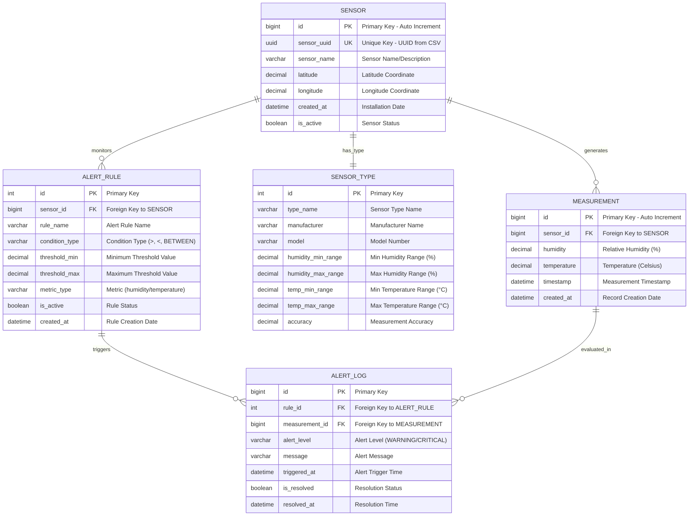

# Esquema de Banco de Dados de Sensores

## Diagrama Entidade-Relacionamento

## Descrição das Tabelas do Banco de Dados

### SENSOR
Armazena informações sobre cada dispositivo sensor físico.
- **id**: Chave primária bigint auto-incremento
- **sensor_uuid**: Identificador UUID correspondente à coluna sensor_id do CSV (restrição única)
- **sensor_name**: Nome legível do sensor
- **latitude**: Coordenada de latitude da localização do sensor (graus decimais)
- **longitude**: Coordenada de longitude da localização do sensor (graus decimais)
- **created_at**: Quando o sensor foi registrado pela primeira vez
- **is_active**: Se o sensor está atualmente operacional

### MEASUREMENT
Armazena leituras individuais dos sensores (corresponde às linhas do CSV).
- **id**: Chave primária auto-incremento
- **sensor_id**: Ligação com a tabela SENSOR
- **humidity**: Porcentagem de umidade relativa (0-100%)
- **temperature**: Temperatura em Celsius
- **timestamp**: Quando a medição foi realizada
- **created_at**: Quando o registro foi inserido no banco de dados

### SENSOR_TYPE
Define diferentes tipos/modelos de sensores com suas especificações.
- **id**: Chave primária para tipos de sensor
- **type_name**: Nome descritivo (ex: "DHT22", "BME280")
- **manufacturer**: Fabricante do sensor
- **model**: Número do modelo
- **humidity_min_range/humidity_max_range**: Faixa operacional de umidade (%)
- **temp_min_range/temp_max_range**: Faixa operacional de temperatura (°C)
- **accuracy**: Especificação de precisão da medição

### ALERT_RULE
Regras configuráveis para monitoramento de valores dos sensores.
- **id**: Chave primária para regras de alerta
- **sensor_id**: Para qual sensor esta regra se aplica
- **rule_name**: Nome descritivo para a regra
- **condition_type**: Tipo de condição (maior que, menor que, entre)
- **threshold_min/threshold_max**: Valores de limite para alertas
- **metric_type**: Se a regra se aplica a umidade ou temperatura
- **is_active**: Se a regra está atualmente habilitada

### ALERT_LOG
Registro histórico de alertas disparados.
- **id**: Chave primária para eventos de alerta
- **rule_id**: Qual regra disparou este alerta (referência para ALERT_RULE.id)
- **measurement_id**: A medição que disparou o alerta (referência para MEASUREMENT.id)
- **alert_level**: Nível de severidade do alerta
- **message**: Mensagem de alerta legível
- **triggered_at**: Quando o alerta foi disparado
- **is_resolved**: Se a condição do alerta foi resolvida
- **resolved_at**: Quando o alerta foi marcado como resolvido

## Relacionamentos Principais

1. **Um-para-Muitos**: Cada sensor pode gerar múltiplas medições
2. **Um-para-Um**: Cada sensor tem um tipo de sensor
3. **Um-para-Muitos**: Cada sensor pode ter múltiplas regras de alerta
4. **Um-para-Muitos**: Cada regra de alerta pode disparar múltiplos alertas
5. **Um-para-Muitos**: Cada medição pode ser avaliada em múltiplos alertas

## Tipos de Dados e Restrições

- **UUIDs**: Usados para identificação de sensores para corresponder ao formato CSV
- **Decimal**: Usado para valores de medição precisos (umidade %, temperatura °C)
- **DateTime**: Todos os timestamps com suporte a fuso horário
- **Restrições**: 
  - Valores de umidade: 0-100%
  - Valores de temperatura: Faixas razoáveis (-40°C a 85°C para sensores típicos)
  - Restrições de chave estrangeira garantem integridade dos dados